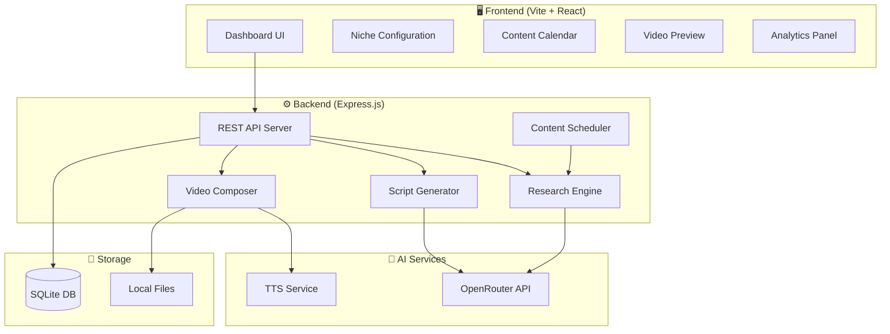
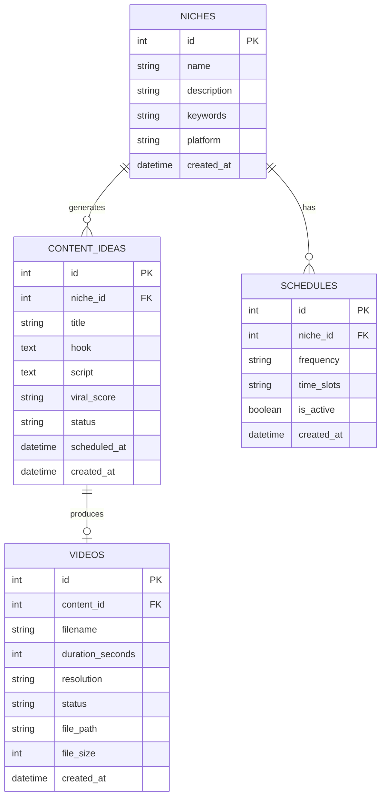

# 🎬 NyarProject - AI Content Creator Platform
## Implementation Plan

---

## 1. Project Overview

**NyarProject** adalah platform web untuk pembuatan video AI Content Creator dengan style UGC (User Generated Content) yang realistik. Platform ini mampu:

- 🔍 **Research** konten viral berdasarkan niche yang dipilih
- ✍️ **Generate script** yang engaging dan hook-driven
- 🎙️ **Text-to-Speech** dengan suara natural/realistik
- 🎬 **Compose video** dengan visual, teks overlay, dan transisi
- 📅 **Schedule** produksi 3 video/hari (90 konten/bulan)
- 📊 **Dashboard analytics** untuk tracking performa konten

---

## 2. Tech Stack

| Layer | Technology | Alasan |
|-------|-----------|--------|
| **Frontend** | Vite + React 18 | Fast build, HMR, modern DX |
| **Styling** | Vanilla CSS (Custom Design System) | Full control, premium aesthetic |
| **Backend** | Express.js + Node.js | Lightweight, flexible REST API |
| **Database** | SQLite (via better-sqlite3) | Zero-config, no Docker needed |
| **AI Research** | OpenRouter API (GPT-4o/Claude) | Content research & script generation |
| **TTS** | ElevenLabs API / Browser Web Speech | Natural voice synthesis |
| **Video Compose** | FFmpeg (via fluent-ffmpeg) | Video rendering & composition |
| **Scheduler** | node-cron | Automated 3x/day production |
| **File Storage** | Local filesystem | Simple, no cloud dependency |

> [!NOTE]
> Docker dan Redis **tidak digunakan** pada fase ini sesuai permintaan user.

---

## 3. Architecture



---

## 4. Database Schema



---

## 5. Core Features

### 5.1 Content Research Engine
- Input niche/keyword → AI menganalisis trending topics
- Menghasilkan 10-20 ide konten dengan viral score
- Hook analysis & competitor content patterns
- Output: Title, Hook, Outline, Estimated Viral Score

### 5.2 Script Generator
- Auto-generate script 30-60 detik berdasarkan ide
- Format: Hook (3s) → Problem (5s) → Solution (15-30s) → CTA (5s)
- Tone: Casual UGC, relatable, engaging
- Multi-language support (ID/EN)

### 5.3 Video Composer
- Text overlay dengan animasi
- Background music integration
- TTS voiceover (natural voice)
- Visual templates (split screen, talking head placeholder, B-roll)
- Output: MP4 720p/1080p vertical (9:16)

### 5.4 Content Scheduler
- Auto-generate 3 video/hari
- Content calendar view (bulan/minggu)
- Queue management & priority system
- Batch processing overnight

### 5.5 Dashboard & Analytics
- Total videos generated
- Content pipeline status
- Niche performance tracking
- Storage usage monitoring

---

## 6. Development Phases

### Phase 1: Foundation & UI ⬅️ *Current*
- [x] Project setup (Vite + React)
- [x] Design system & CSS architecture
- [x] Dashboard layout & navigation
- [x] Niche management UI
- [x] Content calendar UI
- [x] Backend API setup (Express.js)
- [x] SQLite database schema

### Phase 2: AI Research & Script Engine
- [x] OpenRouter API integration
- [x] Content research endpoint
- [x] Script generation endpoint
- [x] Viral score algorithm
- [x] Content idea management UI

### Phase 3: Video Production Pipeline
- [ ] TTS integration (ElevenLabs / Web Speech)
- [ ] FFmpeg video composition
- [ ] Text overlay rendering
- [ ] Template system (UGC styles)
- [ ] Video preview & download

### Phase 4: Automation & Scheduler
- [ ] node-cron scheduler setup
- [ ] Auto research → script → video pipeline
- [ ] 3 videos/day automation
- [ ] Queue management system
- [ ] Error handling & retry logic

### Phase 5: Polish & Optimization
- [ ] Performance optimization
- [ ] Advanced analytics
- [ ] Export to social media formats
- [ ] Bulk operations
- [ ] User settings & preferences

---

## 7. API Endpoints

| Method | Endpoint | Description |
|--------|----------|-------------|
| GET | `/api/niches` | List all niches |
| POST | `/api/niches` | Create new niche |
| DELETE | `/api/niches/:id` | Delete niche |
| GET | `/api/research/:nicheId` | Research content ideas |
| POST | `/api/content/generate-script` | Generate script from idea |
| GET | `/api/content` | List all content |
| PATCH | `/api/content/:id` | Update content status |
| POST | `/api/videos/compose` | Start video composition |
| GET | `/api/videos` | List all videos |
| GET | `/api/videos/:id/download` | Download video |
| GET | `/api/schedule` | Get schedule config |
| POST | `/api/schedule` | Update schedule |
| GET | `/api/analytics/dashboard` | Dashboard stats |

---

## 8. Folder Structure

```
NyarProject/
├── client/                    # Frontend (Vite + React)
│   ├── public/
│   ├── src/
│   │   ├── components/        # Reusable UI components
│   │   ├── pages/             # Page components
│   │   ├── services/          # API service layer
│   │   ├── hooks/             # Custom React hooks
│   │   ├── styles/            # CSS files
│   │   ├── assets/            # Static assets
│   │   ├── App.jsx
│   │   └── main.jsx
│   ├── index.html
│   └── vite.config.js
├── server/                    # Backend (Express.js)
│   ├── routes/                # API routes
│   ├── services/              # Business logic
│   ├── database/              # SQLite setup & migrations
│   ├── utils/                 # Helper functions
│   ├── templates/             # Video templates
│   └── index.js               # Entry point
├── output/                    # Generated videos
├── package.json
└── README.md
```

---

## 9. Environment Variables

```env
# AI Service
OPENROUTER_API_KEY=your_key_here
OPENROUTER_MODEL=openai/gpt-4o

# TTS Service (Optional - Phase 3)
ELEVENLABS_API_KEY=your_key_here

# Server
PORT=3001
CLIENT_PORT=5173

# Video Settings
VIDEO_OUTPUT_DIR=./output
VIDEO_RESOLUTION=1080x1920
VIDEO_FPS=30
```

---

> [!IMPORTANT]
> Phase 1 & 2 akan langsung dikerjakan sekarang. Phase 3-5 bisa dilanjutkan setelah foundation solid.

> [!TIP]
> Untuk video generation yang lebih advanced (talking head, lip sync), bisa diintegrasikan dengan D-ID atau HeyGen API di fase berikutnya.
